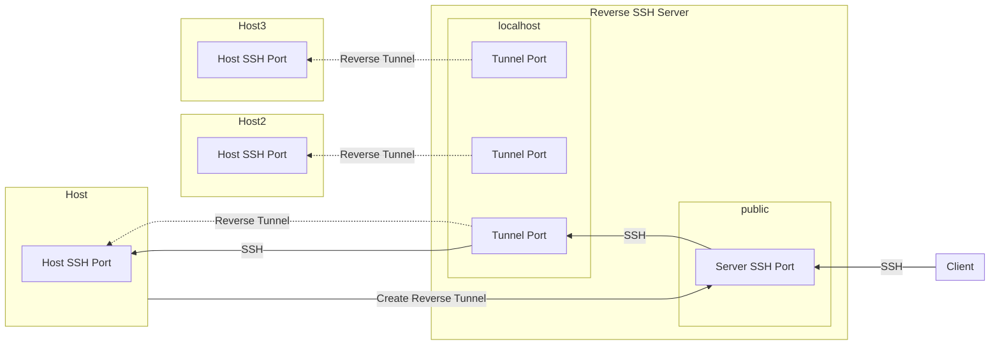

# NQM SSH Tunnel

Creates a reverse SSH tunnel to an SSH server.

This allows for communication between two devices that are both behind a firewall, though the publically accesible Reverse SSH server.

Each host creates a tunnel so that it's accessible via `localhost` on the reverse SSH server. This means that an SSH proxyjump can be used to SSH
through the reverse SSH tunnel to the host.



## Usage

### Setup

First, configure your `~/.ssh/config` to contain the username and hostname of the
SSH server:

```conf
Host nqminds-iot-hub-ssh-control
        HostName ec2-34-251-158-148.eu-west-1.compute.amazonaws.com # change this
        User ubuntu # change this
```

Next, if you do not have a public key configured (e.g. `ls ~/.ssh/*.pub` returns no such file),
then you can create a passphrase-less key with:

```bash
if [ ! -f ~/.ssh/id_ed25519 ]; then
	ssh-keygen -t ed25519 -N "" -C "$(id -u -n)@$(uname -n)" -f ~/.ssh/id_ed25519
fi
```

Then, you can run add the public key (from `cat ~/.ssh/id_ed25519.pub`) to the SSH server.

Finally, you can run the following command to create the SSH tunnel:

```bash
./ssh-tunnel --check # checks to see if the SSH tunnel works
./ssh-tunnel # creates the SSH tunnel (use --destination to specify the server)
```

### Finding the tunnel

When you connect to the SSH server, you will find a folder called `connections`.
Each file will have the name of a connected reverse SSH host, of format `<username>@<hostname>:<port>`, e.g.

```console
ubuntu@nqminds-iot-hub-ssh-control $ ls connections/
alexandru@dazzling-dream:48106
```

You can then connect to one of the hosts via `ssh <username>@localhost -p <port>`.
The port is normally constant.
The only time it changes is if the port is already in use when an SSH client connects to the server (can happen sometimes when a client loses connection to the server and instantly reconnects, while the server still has the previous connection open).

Because the port is constant, you can use the following config to jump straight to a reverse-SSHed device,
from your local PC, in your `~/.ssh/config` file, to just run `ssh dazzling-dream`:

```config
# The SSH Reverse Server
Host amazonhubnqm
	HostName ec2-34-251-158-148.eu-west-1.compute.amazonaws.com
	User ubuntu

Host dazzling-dream
	HostName localhost
	User alexandru
	Port 48106 # this is the port you will see when you run ls connections/ on the server
	ProxyJump amazonhubnqm # we "Jump" through the SSH reverse server
```

### OS specific instructions

To build `ssh-tunnel` for specific operating systems, see [Building packages](./doc/Building-packages.md)

For OS specific usage instructions, see:

- [Debian/Ubuntu](./debian/README.md)
