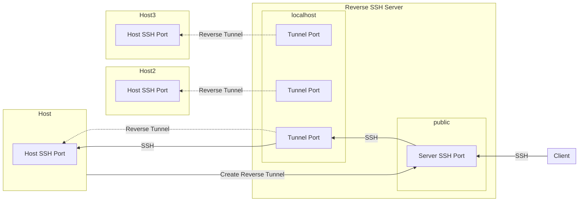

# SSH Legion

Automatic reverse SSH tunnel for multiple IoT devices.

This allows for communication between two devices that are both behind a firewall,
through the publically accesible Reverse SSH server.

Each host creates a tunnel so that it's accessible via `localhost` on the
reverse SSH server. This means that an SSH proxyjump can be used to SSH
through the reverse SSH tunnel to the host.

Importantly, each host creates a file on the server's `~/connections` folder
that contains the port number of the local tunnel port. This means that you
can deploy this `ssh-legion` script on multiple devices, and have them all
use unique ports automatically.

## Contents

- [How it works](./doc/HOW-IT-WORKS.md)
- [Usage](#usage)
  - [Setup on host device](#setup-on-host-device)
  - [Setup on reverse SSH server](#setup-on-reverse-ssh-server)
  - [Connecting from your client device](#connecting-from-your-client-device)
- [OS specific instructions](#os-specific-instructions)
  - [Building packages](./doc/Building-packages.md)
  - [Debian/Ubuntu](./debian/README.md)

## How it works

See [How it works](./doc/HOW-IT-WORKS.md) for full details.



## Usage

### Setup on host device

First, configure your `~/.ssh/config` or `/etc/ssh-legion/ssh-legion.config` to
contain the username and hostname of the SSH server. Or, just copy the contents
of the included [`ssh-legion.config`](./ssh-legion.config).

```conf
Host nqminds-iot-hub-ssh-control
        HostName ec2-34-251-158-148.eu-west-1.compute.amazonaws.com
        User ssh-legion
```

Next, run `./ssh-legion --view-key --check`. This will output your `~/.ssh/id_ed25519.pub` public key, creating it if it does not exist. You can then
add it to the `~/.ssh/authorized_keys` file on the server (see below).

Finally, you can run the following command to create the SSH tunnel:

```bash
./ssh-legion --check # checks to see if the SSH tunnel works
./ssh-legion # creates the SSH tunnel (use --destination to specify the server)
```

### Setup on reverse SSH server

Then, you can run add the public key (from `cat ~/.ssh/id_ed25519.pub`) to the SSH server,
by adding it to `/home/my-loging-username-here/.ssh/authorized_keys`.

If the file does not exist, you can create it.

#### Securing the reverse SSH server

We highly recommned that you lockdown the reverse SSH server, as reverse SSHers
only need minimal permissions.

See [./doc/ssh-legion-server.md](./doc/ssh-legion-server.md) on the recommended
security practices.

### Connecting from your client device

When you connect to the SSH server, you will find a folder called `connections`,
in the home directory of the SSH tunnel user.

Each file will have the name of a connected reverse SSH host, of format `<username>@<hostname>:<port>`.

For example, assuming the reverse SSH tunnel is using the username `ssh-legion`,
you can find all the connections by doing:

```console
ubuntu@nqminds-iot-hub-ssh-control $ ls /home/ssh-legion/connections/
alexandru@dazzling-dream:48106
```

_Hint: Ignore `+disconnected` files with `ls --ignore '*+disconnected'`_

You can then connect to one of the hosts via `ssh <username>@localhost -p <port>`.
The port is normally constant.
The only time it changes is if the port is already in use when an SSH client connects to the server (can happen sometimes when a client loses connection to the server and instantly reconnects, while the server still has the previous connection open).

Because the port is constant, you can use the following config to jump straight to a reverse-SSHed device,
from your local PC, in your `~/.ssh/config` file, to just run `ssh dazzling-dream`:

```conf
# The SSH Reverse Server
Host nqminds-iot-hub-ssh-control
	HostName ec2-34-251-158-148.eu-west-1.compute.amazonaws.com
	User ubuntu

Host dazzling-dream
	HostName localhost
	User alexandru
	Port 48106 # this is the port you will see when you run ls connections/ on the server
	ProxyJump nqminds-iot-hub-ssh-control # we "Jump" through the SSH reverse server
```

If you do get a connection error, first try SSHing into the `nqminds-iot-hub-ssh-control`
and checking that the reverse SSH tunnel actually exists.

### OS specific instructions

To build `ssh-legion` for specific operating systems, see [Building packages](./doc/Building-packages.md)

For OS specific usage instructions, see:

- [Debian/Ubuntu](./debian/README.md)
