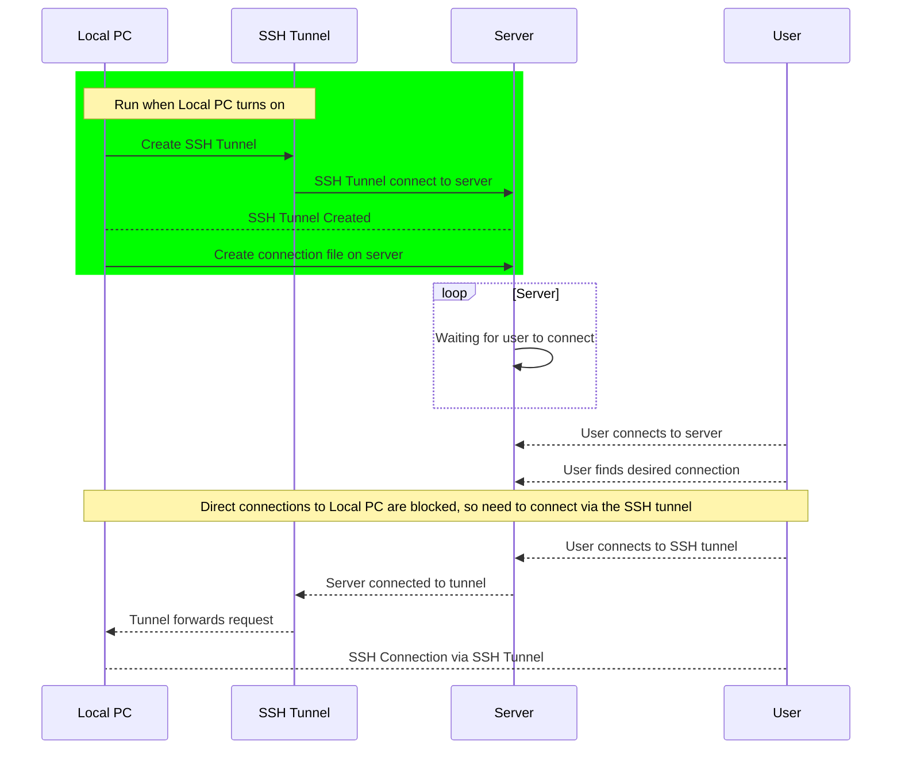

# How the Reverse-SSH Tunnel Works

SSH (Secure Shell) is a network protocol that allows users to
securely open a shell/terminal/console on a remote computer securely over
a network. This allows one to remotely access and control a computer.

In order to access a computer via SSH, one needs:

 - the username
 - the correct private key (or password)
 - the location of the computer on the network

Example usuage (using OpenSSH on Linux):

```bash
ssh username@location-of-server.com -i /path/to/your/private-key/file
```

Unfortunately, although most computers are accessible on a private-intranat
network, they are usually inaccessible to connections from the wider
internet, due to routers/firewalls/NAT. This means, although a computer
inside a private network can SSH **out** of a private network to a server on
the internet, SSH connections **into** the private network are normally
impossible.

## SSH Tunnel

Another feature of most SSH clients is creating an SSH Tunnel.
Essentially, this tunnels the traffic of one port on one computer,
to another port on another computer.

For example, if you were running a website on port 80 of your local computer,
the following command with forward port 1234 on a server
to port 80 on your local computer.

```bash
ssh -R 1234:localhost:80 your-server.com
```

Now if someone attempts to access http://your-server.com:1234, their connection
would be tunneled to the website running on port 80 of your local computer.

This tunnel essentially bypasses firewalls/routers/NAT in a
secure (albeit slow) way.

## Reverse SSH Tunnel

Our code creates an SSH tunnel from the SSH port 22 of our local computer,
to an abritary port on a server.
**The connection is created from the local computer, inside the local network.**

We also create a file on the server containing metadata about the SSH tunnel,
e.g. the name of the local computer, and the port of the server that is
used for the SSH tunnel.

We can then find the file on the server that describes the computer we want
to connect to, the connect via ssh to specified port. The SSH tunnel that we
previously created then tunnels this connection to the local computer, allowing
us to connect.

## Sequence Diagram



_Sequence Diagram created with [mermaid][1]._

[1]: https://github.com/mermaid-js/mermaid
